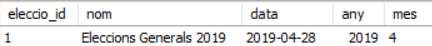

# Apartat 1: Importació de dades
La primera tasca que ens han encomanat és la de realitzar una importació de diferents dades dels processos electorals. Per fer-ho realitzarem un petit programa desenvolupat amb Python utilitzant la llibreria mysql.connector
 
Importació a partir de 02201904_MESA.zip

## Estructura principal
Hem agafat el model d'eleccions de l'abril el 2019 i l'hem descarregat, un cop descarregat el mateix Workbench te l'eina per exportar el script i obtenir totes les sentències, ara resta canviar el nom de la base de dades.

## Modificació estructura
Hem hagut de modificar l'estructura creada anteriorment per adaptarla als diferents errors que hem a anant trobant.
Totes les sentencies utilitzades estan a l'arxiu [BD_eleccions_v2.sql](https://github.com/sonieva/Eleccions/blob/master/Apartat%201/BD_eleccions_v2.sql)

## Introducció de les dades

### Introducció de dades bàsiques
En aquest apartat hem introduït manualment la seguent sentencia SQL:
<br>

```SQL 
INSERT INTO eleccions (eleccio_id, nom, data)
    VALUES (1,"Eleccions Generals 2019", "2019-04-28");
```

I ha quedat aixi a la BD: 
<br>



### Importació de comunitats autònomes, províncies i municipis
Per l'importacio d'aquestes dades necessitem el arxiu [07021904.DAT](Documentació/02201904_MESA/07021904.DAT) per les taules de `comunitats_autonomes` i `provincies`. 

I l'arxiu [05021904.DAT](Documentació/02201904_MESA/05021904.DAT) per les taules de `municipis` i `eleccions_municipis`

<br>

Programes utilitzats:
- [importacio_CCAA.py](Apartat%201/importacio_CCAA.py)
- [importacio_provincies.py](Apartat%201/importacio_provincies.py)
- [importacio_municipis.py](Apartat%201/importacio_municipis.py)
- [importacio_eleccions_municipis.py](Apartat%201/importacio_eleccions_municipis.py)

### Importació de candidatures, candidats i persones
Per aquest apartat hem necessitat el arxiu [03021904.DAT](Documentació/02201904_MESA/03021904.DAT) per la taula `candidatures`.

I el [04021904.DAT](Documentació/02201904_MESA/04021904.DAT) per les taules `persones` i `candidats`

<br>

Programes utilitzats:
- [importacio_candidatures.py](Apartat%201/importacio_candidatures.py)
- [importacio_persones](Apartat%201/importacio_persones.py)
- [importacio_candidats.py](Apartat%201/importacio_candidats.py)

### Importació de vots a nivell municipal, provincial i autonòmic
Per l'ultim apartat hem utilitzat el arxiu [06021904.DAT](Documentació/02201904_MESA/06021904.DAT) per la taula `vots_candidatures_ca`.

I per les taules `vots_candidatures_prov` i `vots_candidatures_mun` ens hem ajudat de l'arxiu [08021904.DAT](Documentació/02201904_MESA/08021904.DAT)

## Estructura del programa en pseudocodi
En acabar cada programa de forma individual, hem juntat tots en un sol arxiu .py per facilitar la tasca de introduir els valors a la base de dades. El programa esta realitzat de tal manera que demana el host, l'usuari, la contrasenya i la base de dades on es vol fer la importacio de les dades.

Programa: [importacio_dades.py](Apartat%201/importacio_dades.py)

<br>

# Apartat 2: Creació de sentències de consulta SQL
La segona tasca que ens han encomenat es una vegada tenim les dades ja importades hem de realitzar diferents consultes a la base de dades per comprovar que han sigut correctament importades

## Categoria 1
Aquesta categoria son consultes "basiques", només amb una taula, funcions, funcions d'agregat i grups.

```SQL
-- Fes una consulta on ens demani el codi_candidatura i el nom_llarg on el nom_curt sigui "EB" i ordena per candidatura_id de forma descendent.
SELECT codi_candidatura,nom_llarg 
	FROM candidatures
WHERE nom_curt = "EB"
ORDER BY candidatura_id DESC;

-- Mostra totes les persones que no tinguin el DNI posat a la base de dades.
SELECT nom,cog1,cog2,dni
	FROM persones
WHERE dni IS NULL;

-- Mostra quantes candidatures té el PP
SELECT COUNT(*)
	FROM candidatures
WHERE nom_curt = 'PP';

-- Mostra el municipi_id i la candidatura_id de les candidatures votades a nivell municipal que tinguin més de 5000 vots. Orderna per nombre de vots
SELECT candidatura_id,vots 
	FROM vots_candidatures_mun
WHERE vots > 5000
ORDER BY vots;

-- Mostra el nom i el cognom de les persones que es diguin igual que algun membre del grup
SELECT nom,cog1
	FROM persones
WHERE nom IN ("Jordi","Mark","Hemant","Santiago")
ORDER BY nom;
```
Arxiu d'origen: [sentencies_categoria_1.sql](Apartat%202/sentencies_categoria_1.sql)

## Categoria 2
En aquesta categoria hem utilitzat consultes amb més d'una taula: INNER JOIN, LEFT JOIN.
```SQL
-- Mostra el nom complet de totes les persones, el seu candidat_id i el nom llarg de la candidatura on estan
SELECT c.candidat_id, p.nom, p.cog1, p.cog2, c1.nom_llarg
	FROM persones p
	INNER JOIN candidats c ON p.persona_id = c.persona_id
	INNER JOIN candidatures c1 ON c.candidatura_id = c1.candidatura_id
ORDER BY p.nom;

-- Mostra el codi_ine,provincia_id i el nom de totes les provincies com a nom_pro i el municipi_id i el nom de tots els municipis com a nom_mun de "Cataluña".
SELECT c.codi_ine, p.provincia_id,
		p.nom AS nom_pro, 
        m.municipi_id, 
        m.nom AS nom_mun
	FROM comunitats_autonomes c
    INNER JOIN provincies p ON c.comunitat_aut_id = p.comunitat_aut_id
    INNER JOIN municipis m ON p.provincia_id = m.provincia_id
    WHERE upper(c.nom) = 'CATALUÑA';

-- Fes una consulta per veure el nom de la provincia, codi_ine, candidatura_id i els vots per cada candidatura, ordena per numero de vots
SELECT p.nom,p.codi_ine,v.candidatura_id,v.vots 
	FROM vots_candidatures_prov v
	INNER JOIN provincies p ON p.provincia_id = v.provincia_id
ORDER BY vots;

-- Per cada municipi volem saber el seu nom, la provincia a la que pertany, el nom de les eleccions i la data. També volem que mostri municipis que tinguin 4 cops mes de vots valids que de vots en blanc
SELECT 	m.nom as nom_municipi,
		p.nom as nom_provincia, 
        e.nom as nom_eleccions, 
        e.data as data_eleccions 
	FROM municipis m
	INNER JOIN provincies p ON m.provincia_id = p.provincia_id
	INNER JOIN eleccions_municipis em ON em.municipi_id = m.municipi_id
	INNER JOIN eleccions e ON e.eleccio_id = em.eleccio_id
WHERE em.vots_valids>(4*em.vots_blanc);

-- Per cada provincia de la comunitat_aut_id = 1 i comunitat_aud_id = 2, volem saber el seu nom i el total de vots que ha obtingut cada provincia, a mes, volem saber el nom de la comunitat autonoma.
SELECT 	p.nom AS nom_provincia, 
		sum(vcp.vots) AS vots,
        ca.nom AS nom_comunitat_autonoma 
	FROM provincies p
	INNER JOIN vots_candidatures_prov vcp ON p.provincia_id = vcp.provincia_id
	INNER JOIN comunitats_autonomes ca ON ca.comunitat_aut_id = p.comunitat_aut_id
WHERE ca.comunitat_aut_id IN (1,2)
GROUP BY p.provincia_id
```
Arxiu d'origen: [sentencies_categoria_2.sql](Apartat%202/sentencies_categoria_2.sql)

## Categoria 3
En aquesta categroia hem fet ús de subconsultes

```SQL
-- Mostra el sexe, cognoms i nom de les persones que pertanyin al tipus "T" (Titular)
SELECT nom, concat(cog1," ",cog2) as cognoms, sexe 
	FROM persones
WHERE persona_id IN (	SELECT persona_id 
							FROM candidats
						WHERE tipus = "T"	);
                        
-- Mostra el nom de la comunitat autonoma amb el major numero de vots per la candidatura_id = 95
SELECT nom
	FROM comunitats_autonomes ca
    INNER JOIN vots_candidatures_ca vca ON vca.comunitat_autonoma_id = ca.comunitat_aut_id
    INNER JOIN candidatures c ON c.candidatura_id = vca.candidatura_id
WHERE c.candidatura_id = 95 AND vca.vots = (SELECT MAX(vots) FROM vots_candidatures_ca WHERE candidatura_id = 95);

-- Mostra tots els municipis de "Cataluña" ordenats pel nom;
SELECT  m.municipi_id, m.nom, m.codi_ine 
	FROM municipis m
    INNER JOIN provincies p ON p.provincia_id = m.provincia_id
    INNER JOIN comunitats_autonomes c ON c.comunitat_aut_id = p.comunitat_aut_id
WHERE c.comunitat_aut_id = (	SELECT comunitat_aut_id
									FROM comunitats_autonomes
								WHERE upper(nom) = 'CATALUÑA'	)
ORDER BY nom;

-- Mostra el nom llarg com nom_partit i el numero de vots de les candidatures votades a nivell provincial de la provincia del municipi de Purchena. Ordena per numero de vots de forma descendent
SELECT c.nom_llarg AS nom_partit, v.vots 
	FROM vots_candidatures_prov v
    INNER JOIN provincies p ON p.provincia_id = v.provincia_id
    INNER JOIN candidatures c ON c.candidatura_id = v.candidatura_id
WHERE p.provincia_id = (	SELECT provincia_id 
								FROM municipis
							WHERE nom = 'Purchena'	)
ORDER BY v.vots DESC;
```
Arxiu d'orgien: [sentencies_categoria_3.sql](Apartat%202/sentencies_categoria_3.sql)

## Categoria 4  
En l'ultima categoria nomes hem fet 1 consulta utilizant les window functions 
```SQL
WITH RECURSIVE eleccions_totals AS (
  SELECT m.municipi_id, m.nom, m.codi_ine 
    FROM municipis m
    INNER JOIN provincies p ON p.provincia_id = m.provincia_id
    INNER JOIN comunitats_autonomes c ON c.comunitat_aut_id = p.comunitat_aut_id
  WHERE c.comunitat_aut_id = (  SELECT comunitat_aut_id
                                    FROM comunitats_autonomes
                                WHERE upper(nom) = 'CATALUÑA'   ))

SELECT *
    FROM eleccions_totals
ORDER BY nom;
```

